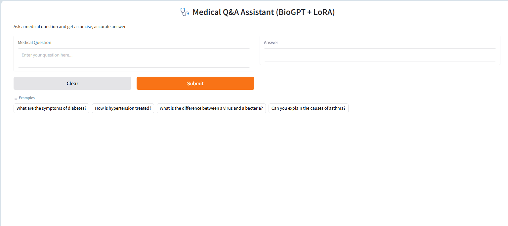

# BioGPT-MedQuad: Fine-Tuned Medical QA Assistant

[](https://opensource.org/licenses/MIT)
[](https://www.python.org/)
[](https://github.com/huggingface/transformers)
[](https://github.com/huggingface/peft)
[](https://pytorch.org/)
[](https://arxiv.org/abs/2106.10169)

> 🩺 A fine-tuned version of **BioGPT** on medical Q&A using the **MedQuad dataset**, enhanced with **LoRA** for efficient adaptation.

This repository contains code to fine-tune and deploy a **medical question-answering model** based on **BioGPT**, using the MedQuad dataset and LoRA (Low-Rank Adaptation) for fast training and inference. The resulting model can be used in chatbots, clinical assistants, or as a backend for medical information retrieval systems.

---

## 🔍 Features

- ✅ Fine-tunes BioGPT using **LoRA** for parameter-efficient transfer learning
- 📚 Trained on the **MedQuad Medical Q&A Dataset**
- 💬 Generates concise, medically relevant answers
- 🧠 Uses Hugging Face's `transformers`, `datasets`, and `peft` libraries
- 🚀 Supports GPU acceleration via CUDA
- 🧪 Includes evaluation and generation scripts for testing
- 🛡️ Safe token handling and post-processing to avoid truncated responses

---

## 🧰 Requirements

Before running this project, ensure you have the following installed:

```bash
pip install torch transformers datasets peft accelerate bitsandbytes safetensors gradio
```

---

## 📦 Datasets Used

- keivalya/MedQuad-MedicalQnADataset

## Model Architecture

- Base Model: microsoft/biogpt
- Fine-Tuning Method: LoRA (Low-Rank Adaptation)
- Trainable Parameters: ~1% of total parameters
- Target Modules: Query and Value projection matrices

## Training Configuration

| Hyperparameter        | Value |
| --------------------- | ----- |
| Learning Rate         | 2e-4  |
| Batch Size            | 4     |
| Gradient Accumulation | 2     |
| Epochs                | 3     |
| LoRA Rank (r)         | 8     |
| LoRA Alpha            | 16    |
| Max Sequence Length   | 512   |

## Results

Example outputs from the fine-tuned model:
**Q**: What are the symptoms of diabetes?
**A**: Common symptoms of diabetes include frequent urination, excessive thirst, unexplained weight loss, increased hunger, blurry vision, slow healing of wounds, and fatigue. In type 1 diabetes, symptoms may develop quickly, while in type 2 diabetes they may develop more gradually.

**Q**: How is hypertension treated?
**A**: Hypertension is typically treated through lifestyle modifications and medications. Lifestyle changes include reducing salt intake, regular exercise, maintaining a healthy weight, and limiting alcohol. Common medications include ACE inhibitors, ARBs, calcium channel blockers, and diuretics. Treatment plans are tailored to individual patient needs.

## Demo

[]

## License

This project is licensed under the MIT License.

## Acknowledgements

- Microsoft Research for BioGPT
- Hugging Face for Transformers and PEFT libraries
- MedQuad dataset contributors
